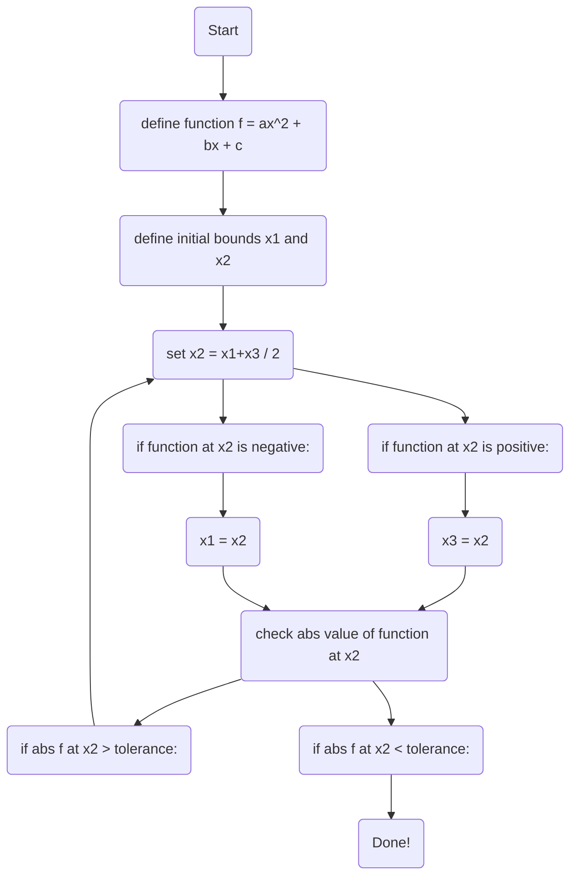

# Bisection Process Flow:
***

```mermaid
graph TD

%%topnode:

id1(Start)

id1.1(define function f = ax^2 + bx + c)

id1.2(define initial bounds x1 and x2)

id1.3(set x2 = x1+x3 / 2)

id1.4(if function at x2 is positive:)

id1.5(if function at x2 is negative:)


id1.6(x3 = x2)

id1.7(x1 = x2)

id1.8(check abs value of function at x2)

id1.9(if abs f at x2 > tolerance:)

id1.10(if abs f at x2 < tolerance:)


id1.11(Done!)

id1 --> id1.1 --> id1.2 --> id1.3

id1.3 --> id1.4 & id1.5

id1.4 --> id1.6 --> id1.8

id1.5 --> id1.7 --> id1.8

id1.8 --> id1.9 & id1.10

id1.9 --> id1.3

id1.10 --> id1.11

```
