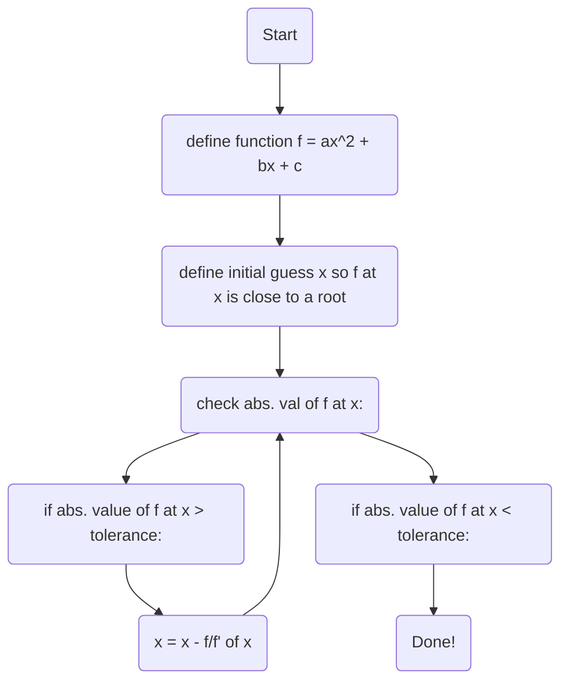

# Newton-Raphson Process Flow:
***

```mermaid
graph TD

%%topnode:

id1(Start)

id1.1(define function f = ax^2 + bx + c)

id1.2(define initial guess x so f at x is close to a root)

id1.3(check abs. val of f at x:)

id1.4(if abs. value of f at x > tolerance:)
id1.5(if abs. value of f at x < tolerance:)

id1.6(x = x - f/f' of x)

id1.7(Done!)


id1 --> id1.1 --> id1.2 --> id1.3 --> id1.4 & id1.5


id1.4 --> id1.6 --> id1.3

id1.5 --> id1.7


```
